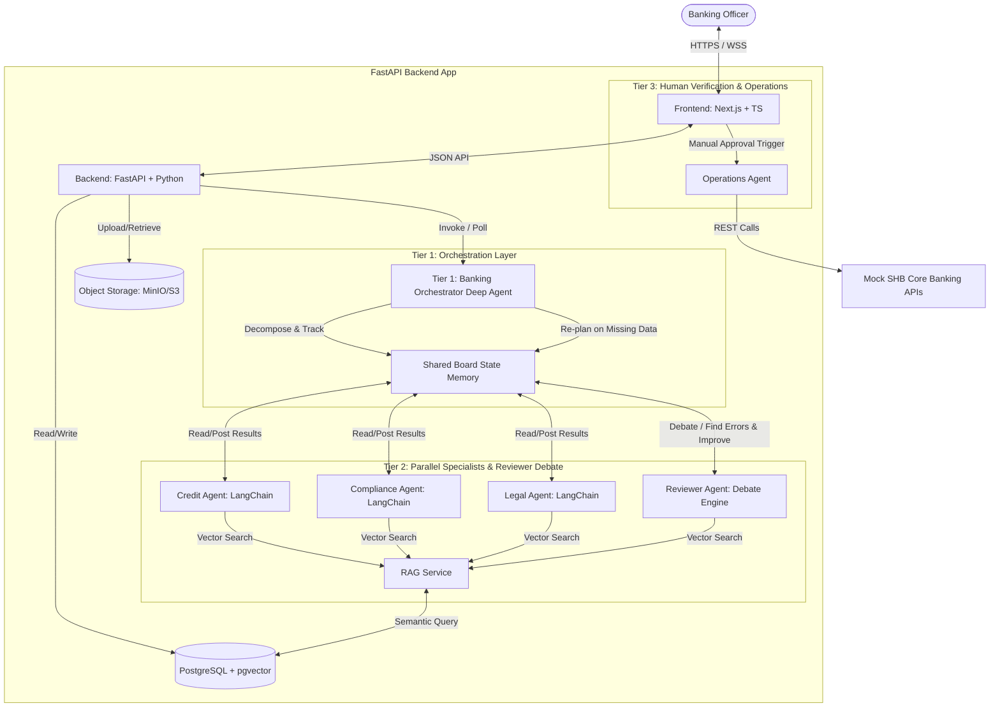
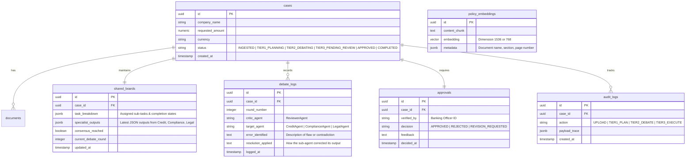

# System Architecture Document (ARCHITECTURE.md)

This document describes the technical architecture, component design, and data flows for the **Digital Expert Agents** system. The architecture is modular, domain-oriented, and structured around a **3-Tier Deep Agent Pipeline** using the **Shared Board (Blackboard)** pattern.

---

## 1. System Topology & 3-Tier Pipeline Overview



---

## 2. Component Design & 3-Tier Agentic Layer

### 2.1. Frontend (Next.js, TypeScript, Tailwind CSS)
Organized using a **Feature-based structure** to isolate independent domains:
*   `features/cases`: Case creation, document upload, and initial submission to Tier 1.
*   `features/assessment`: Visual representation of the **Shared Board**, displaying specialist findings, calculated financial ratios, and the **Reviewer Agent debate log** (showing how errors were identified and resolved).
*   `features/approval`: Human verification console with RAG policy citation links and approval/reject/revision triggers.
*   `shared`: Reusable UI components, layout shells, and API polling hooks.

### 2.2. Backend (FastAPI, Python)
FastAPI acts as the asynchronous API gateway and state broker:
*   **Case Service:** Handles CRUD for loan applications and coordinates document uploads to Object Storage.
*   **Shared Board & Orchestration Service:** Manages LangGraph state transitions, persisting the `Shared Board` structure to PostgreSQL after every agent execution turn.

### 2.3. Agentic Layer (LangGraph Deep Agent & Shared Board Pattern)

#### Tier 1: Banking Orchestrator (Deep Agent)
Built on `LangGraph` as a stateful supervisory **Deep Agent**:
*   **Understand & Plan:** Reads loan constraints and uploaded files, establishing an initial evaluation graph.
*   **Task Decomposition & Delegation:** Divides work into specific domain tasks (`credit_analysis`, `compliance_check`, `legal_review`) and assigns them to specialist agents via the Shared Board.
*   **Execution Monitoring & Re-planning:** Watches task completion statuses. If a specialist agent fails due to missing data (e.g., missing audit notes), the Orchestrator halts Tier 2, re-plans the workflow, and prompts for additional inputs.
*   **Result Synthesis:** Once Tier 2 consensus is reached, the Orchestrator synthesizes all findings into a unified draft report for human verification.

#### Tier 2: Parallel Specialist Agents & Reviewer (Debate Engine)
Operates as a **Blackboard Architecture (Shared Board)** where agents communicate exclusively by reading and writing structured data to a shared memory state:
*   **Specialist Agents (Parallel Execution):**
    *   **Credit Agent:** Calculates DSCR, Current Ratio, and Leverage using financial statement parsing tools and RAG guidelines.
    *   **Compliance Agent:** Screens borrower details against KYC, AML, and Sanctions databases/mock endpoints.
    *   **Legal Agent:** Verifies corporate governance, collateral ownership titles, and article clauses.
*   **Reviewer Agent (Debate & Quality Improvement Engine):**
    *   **Error Detection (`Tìm lỗi sai`):** Continuously reviews the outputs posted on the Shared Board. It audits mathematical checks, validates cross-department consistency, and verifies that every claim cites a valid RAG policy chunk.
    *   **Adversarial Debate (`Debate & Improve`):** If an error or contradiction is detected (e.g., high debt capacity claimed despite legal litigation warnings), the Reviewer posts a critique (`ReviewerDebateLog`) to the Shared Board and instructs the target specialist agent to recalculate or justify its findings.
    *   **Loop Termination:** The debate iterates until all errors are resolved or a configurable maximum loop limit (`max_debate_rounds = 3`) is reached.

#### Tier 3: Human Verification & Operations Agent
*   **Human Verification:** The human officer inspects the final synthesized output, RAG citations, and the debate history before granting explicit sign-off.
*   **Operations Agent:** Activated strictly upon human verification. It translates the approved assessment into operational outputs (e.g., `Draft_Credit_Agreement.pdf` and `Core_Banking_Onboarding.json`) via **Mock SHB Core Banking APIs**.

### 2.4. RAG Service
*   Utilizes **pgvector** inside PostgreSQL for vector similarity searches.
*   Indexes internal banking policies, credit underwriting guidelines, and risk calculation formulas.
*   Provides semantic retrieval with exact document section citations (`page_number`, `section_id`) to all Tier 2 agents.

### 2.5. Mock SHB APIs
*   Simulates enterprise banking systems (`Customer Master`, `Credit Ledger`, `Document Management System`).
*   Returns deterministic responses (`200 OK`, `400 Bad Request`) to validate operational execution paths during Tier 3 testing.

---

## 3. Storage Strategy & Database Schemas

### 3.1. Relational & Vector Database (PostgreSQL + pgvector)



---

## 4. Main System Data Flow (Detailed 3-Tier Trace)

```
[User] --(1) Upload Docs--> [Frontend] --(2) Create Case--> [FastAPI Backend]
                                                                |
                                                      (3) Store DB & S3
                                                                |
[User] --(4) Start Assessment--> [Frontend] --(5) Invoke Tier 1--> [Orchestrator Deep Agent]
                                                                          |
                                                            (6) Plan & Init Shared Board
                                                                          |
                                                                          v
+-------------------------------------------------------------------------------------------------+
| TIER 2: SPECIALIST AGENTS & REVIEWER DEBATE LOOP (SHARED BOARD)                                 |
|                                                                                                 |
|   +-----------------------------------------------------------------------------------------+   |
|   | Shared Board Memory (PostgreSQL JSONB State)                                            |   |
|   +-----------------------------------------------------------------------------------------+   |
|         ^                         ^                         ^                       ^           |
|         | Read/Write              | Read/Write              | Read/Write            | Read/Crit |
|         v                         v                         v                       v           |
|  +--------------+          +--------------+          +--------------+        +---------------+  |
|  | Credit Agent |          | Compliance   |          | Legal Agent  |        | Reviewer Agent|  |
|  +--------------+          +--------------+          +--------------+        | (Debate Engine|  |
|         |                         |                         |                +---------------+  |
|         +-------------------------+-------------------------+                        |          |
|                                   |                                                  |          |
|                                   v                                                  |          |
|                          [Query RAG Policies]                                        |          |
|                                   ^                                                  |          |
|                                   +-------------------(Audits Errors & Prompts Fix)--+          |
+-------------------------------------------------------------------------------------------------+
                                                                          |
                                                      (7) Synthesize Verified Results
                                                                          |
                                                                          v
[User] <-- (9) Review Board & Citations -- [Frontend] <--- (8) Push Consolidated Report
   |
(10) Approve Assessment
   |
   v
+-------------------------------------------------------------------------------------------------+
| TIER 3: HUMAN VERIFICATION & OPERATIONAL EXECUTION                                              |
|                                                                                                 |
| [Frontend] --(11) Send Approval--> [FastAPI Backend] --(12) Trigger--> [Operations Agent]      |
|                                                                                |                |
|                                                                      (13) Execute Pre-checks    |
|                                                                                |                |
|                                                                                v                |
|                                                                   [Mock SHB Core Banking APIs]  |
+-------------------------------------------------------------------------------------------------+
```

---

## 5. Domain-Oriented Directory Structure

To support scalable team development and maintain clear modular boundaries, repositories must follow this structure:

### 5.1. Frontend Workspace (`/frontend`)
```
frontend/
├── src/
│   ├── app/                    # Next.js App Router
│   │   ├── cases/              # /cases dashboard router
│   │   │   ├── [id]/           # /cases/:id details & verification view
│   │   │   └── page.tsx        
│   │   └── page.tsx            # Landing Page
│   ├── features/               # Domain-Driven Feature Directories
│   │   ├── cases/              # Document upload & case initiation
│   │   │   ├── components/     # DocumentUploadZone.tsx, CaseCreationModal.tsx
│   │   │   └── hooks/          # useCaseMutation.ts
│   │   ├── assessment/         # Tier 2 Shared Board & Debate Log visualization
│   │   │   ├── components/     # SharedBoardGrid.tsx, DebateLogViewer.tsx, RatioTable.tsx
│   │   │   └── hooks/          # useSharedBoardQuery.ts
│   │   └── approval/           # Tier 3 Human verification & operations trigger
│   │       ├── components/     # VerificationPanel.tsx, RagCitationModal.tsx
│   │       └── hooks/          # useApproveAndExecute.ts
│   ├── shared/                 # Shared UI components and API clients
│   │   ├── components/         # ui/button.tsx, ui/dialog.tsx
│   │   ├── styles/             # index.css (Tailwind tokens)
│   │   └── utils/              # api-client.ts, formatters.ts
```

### 5.2. Backend Workspace (`/backend`)
```
backend/
├── app/
│   ├── main.py                 # FastAPI Gateway entry point
│   ├── config.py               # Environments, Database URLs, LLM Credentials
│   ├── api/                    # REST HTTP Endpoints
│   │   ├── v1/
│   │   │   ├── cases.py        # Case management & file upload routes
│   │   │   ├── orchestrator.py # Tier 1 execution & Shared Board state routes
│   │   │   └── operations.py   # Tier 3 operations execution triggers
│   ├── db/                     # DB Connection, SQLAlchemy models, migrations
│   │   ├── session.py
│   │   └── models.py           # DB Schemas (cases, shared_boards, debate_logs, approvals)
│   ├── services/               # Core business services
│   │   ├── storage.py          # MinIO/S3 document management
│   │   └── rag.py              # Semantic vector queries & pgvector indexer
│   ├── agents/                 # 3-Tier Multi-Agent System
│   │   ├── tier1_orchestrator/ # Deep Agent planning, decomposition & tracking
│   │   │   ├── deep_agent.py
│   │   │   └── replanner.py
│   │   ├── tier2_board/        # Shared Board memory & Specialist/Reviewer agents
│   │   │   ├── shared_board.py # Blackboard state manager
│   │   │   ├── reviewer.py     # Debate & error checking engine
│   │   │   └── specialists/    # Parallel worker agents
│   │   │       ├── credit.py
│   │   │       ├── compliance.py
│   │   │       └── legal.py
│   │   └── tier3_operations/   # Post-approval operations agent
│   │       └── operations.py
│   └── mock_apis/              # SHB Mock Core Systems
│       ├── shb_client.py       # Simulated API calls to mock core
│       └── mock_endpoints.py   # FastAPI routes mimicking SHB servers
```
