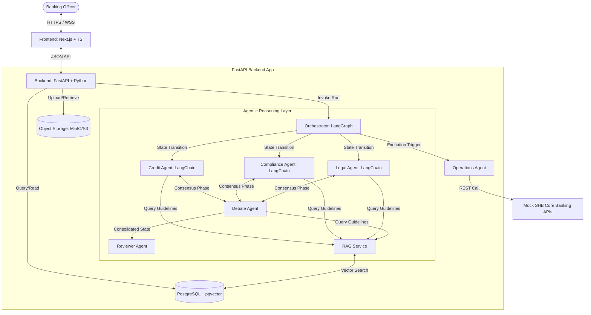
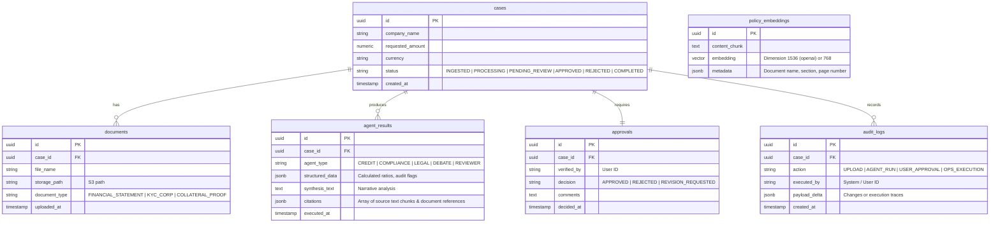

# System Architecture Document (ARCHITECTURE.md)

This document describes the technical architecture, component design, and data flows for the **Digital Expert Agents** system. The architecture is modular, domain-oriented, and structured for developer and AI coding agent readability.

---

## 1. System Topology & Component Overview



---

## 2. Component Design

### 2.1. Frontend (Next.js, TypeScript, Tailwind CSS)
Organized using a **Feature-based structure** to isolate independent domains:
*   `features/cases`: Components and hooks for loan case list, creation form, and document uploads.
*   `features/assessment`: Multi-agent visual timeline, department assessment grids, conflict resolution interface, RAG citation links, and document viewers.
*   `features/approval`: Manual sign-off form, verification step tracker, and triggers for execution.
*   `shared`: UI design system (buttons, modals, layout frames) and API client hooks.

### 2.2. Backend (FastAPI, Python)
FastAPI acts as the API gateway, hosting the REST endpoints, serving files, and managing database connections.
*   **Case Service:** Handles CRUD for loan applications and coordinates document uploads to object storage.
*   **Orchestration Service:** Manages LLM agent run state, starting LangGraph workflows asynchronously, and reporting real-time status via WebSockets or polling.

### 2.3. Agentic Layer (LangGraph & LangChain Deep Agents)
*   **Orchestrator (LangGraph):** A state chart workflow engine that models the assessment process as a directed graph. It handles state propagation, conditional branching (e.g., repeating a stage if a validator fails), and concurrency.
*   **Specialist Agents (LangChain):**
    *   **Credit Agent:** Parses balance sheets, retrieves external/mock benchmark ratios via tools, and checks debt viability.
    *   **Compliance Agent:** Verifies KYC compliance, cross-checks against AML/Sanctions tables, and flags violations.
    *   **Legal Agent:** Analyzes security documents, corporate articles of incorporation, and contract frameworks.
*   **Debate Agent:** Initiates a round-table refinement between the specialist agents. It takes contrasting arguments (e.g., Credit Agent states high leverage is acceptable due to secure revenue; Legal Agent points out high litigation risk) and prompts a consensus summary.
*   **Reviewer Agent:** Acts as a quality gate. It verifies that agent outputs contain matching evidence and citations from the RAG service before marking the graph output as final.
*   **Operations Agent:** Active only post-verification. Generates draft contract documents and schedules onboarding transactions against Mock Banking APIs.

### 2.4. RAG Service
*   Uses **pgvector** as the semantic index.
*   Chunks and indexes internal policy documents (e.g., "Corporate Credit Underwriting Policy v4").
*   Exposes a semantic search interface utilized by specialist agents during their execution step.

### 2.5. Mock SHB APIs
*   Simulates internal bank systems (Customer Master, Credit Ledger, Document Management System).
*   Returns standardized success/fail payloads to test boundary failure cases during operations execution.

---

## 3. Storage Strategy & Data Schemas

### 3.1. Relational & Vector Database (PostgreSQL + pgvector)



### 3.2. Object Storage (S3 / MinIO API)
*   Stores raw uploaded files (unstructured PDFs, Excel sheets).
*   Enforces access policy keys tied to the specific Loan Case ID. Files are accessed via short-lived presigned URLs.

---

## 4. Main System Data Flow

```
[User] --(1) Upload Docs--> [Frontend] --(2) Post Case--> [FastAPI Backend]
                                                                  |
                                                           (3) Save DB & S3
                                                                  |
[User] --(4) Run Analysis--> [Frontend] --(5) Trigger Run--> [Orchestrator (LangGraph)]
                                                                  |
                                                       (6) Fetch Docs & Guidelines
                                                                  |
                                                                  v
                                                     +--------------------------+
                                                     |    Agent State Graph     |
                                                     |                          |
                                                     |  +--------------------+  |
                                                     |  | Credit Agent       |  |
                                                     |  +--------------------+  |
                                                     |            |             |
                                                     |  +--------------------+  |
                                                     |  | Compliance Agent   |  |
                                                     |  +--------------------+  |
                                                     |            |             |
                                                     |  +--------------------+  |
                                                     |  | Legal Agent        |  |
                                                     |  +--------------------+  |
                                                     |            |             |
                                                     |            v             |
                                                     |  +--------------------+  |
                                                     |  | Debate Agent       |  |
                                                     |  +--------------------+  |
                                                     |            |             |
                                                     |            v             |
                                                     |  +--------------------+  |
                                                     |  | Reviewer Agent     |  |
                                                     |  +--------------------+  |
                                                     +--------------------------+
                                                                  |
                                                        (7) Save Results to DB
                                                                  |
[User] <-- (9) View Details & Approve -- [Frontend] <--- (8) Push Final JSON Status
   |
(10) Confirm Execution
   |
   v
[Frontend] --(11) Trigger Ops--> [FastAPI Backend] --(12) Trigger Ops--> [Operations Agent]
                                                                                 |
                                                                       (13) Call Mock APIs
                                                                                 |
                                                                                 v
                                                                       [Mock SHB Core APIs]
```

---

## 5. Domain-Oriented Directory Structure

To support team development and clarify boundaries, the repositories must follow these structures:

### 5.1. Frontend Workspace (`/frontend`)
```
frontend/
├── src/
│   ├── app/                    # Next.js App Router (pages and layouts)
│   │   ├── cases/              # /cases dashboard router
│   │   │   ├── [id]/           # /cases/:id details page
│   │   │   └── page.tsx        
│   │   └── page.tsx            # Login / Landing Page
│   ├── features/               # Domain-Driven Feature Directories
│   │   ├── cases/              # Uploading documents, creating applications
│   │   │   ├── components/     # DocumentUploadZone.tsx, CaseCreationModal.tsx
│   │   │   └── hooks/          # useCaseMutation.ts
│   │   ├── assessment/         # Analyzing agent results, showing metrics
│   │   │   ├── components/     # AgentResultGrid.tsx, RatioAnalysisTable.tsx, FlagAlertBanner.tsx
│   │   │   └── hooks/          # useAssessmentQuery.ts
│   │   └── approval/           # Sign-off interface & audit logs
│   │       ├── components/     # ActionPanel.tsx, SignatureModal.tsx
│   │       └── hooks/          # useApproveCase.ts
│   ├── shared/                 # Generic shared utilities and design library
│   │   ├── components/         # ui/button.tsx, ui/dialog.tsx (vanilla css module styled)
│   │   ├── styles/             # index.css (design tokens, layout framework)
│   │   └── utils/              # api-client.ts, formatters.ts
```

### 5.2. Backend Workspace (`/backend`)
```
backend/
├── app/
│   ├── main.py                 # FastAPI Gateway entry point
│   ├── config.py               # Environments, Database URLs, LLM Credentials
│   ├── api/                    # REST HTTP Endpoints
│   │   ├── v1/
│   │   │   ├── cases.py        # Case upload & management routes
│   │   │   ├── assessments.py  # Assessment run execution & stream routes
│   │   │   └── operations.py   # Operation execution triggers
│   ├── db/                     # DB Connection, SQLAlchemy/SQLModel models, migrations
│   │   ├── session.py
│   │   └── models.py           # DB Schemas mapping directly to Section 3.1
│   ├── services/               # Core business services
│   │   ├── storage.py          # MinIO/S3 file management
│   │   └── rag.py              # Semantic vector queries & pgvector indexer
│   ├── agents/                 # Multi-agent LangGraph workflow
│   │   ├── orchestrator.py     # LangGraph compilation & state tracking
│   │   ├── reviewer.py         # Reviewer agent configuration
│   │   ├── operations.py       # Operations execution agent
│   │   ├── debate.py           # Agent conflict debate resolution stage
│   │   └── specialists/        # Worker agents (LangChain implementations)
│   │       ├── credit.py
│   │       ├── compliance.py
│   │       └── legal.py
│   └── mock_apis/              # SHB Mock Core Systems
│       ├── shb_client.py       # Simulated API calls to mock core
│       └── mock_endpoints.py   # FastAPI routes mimicking SHB servers
```
