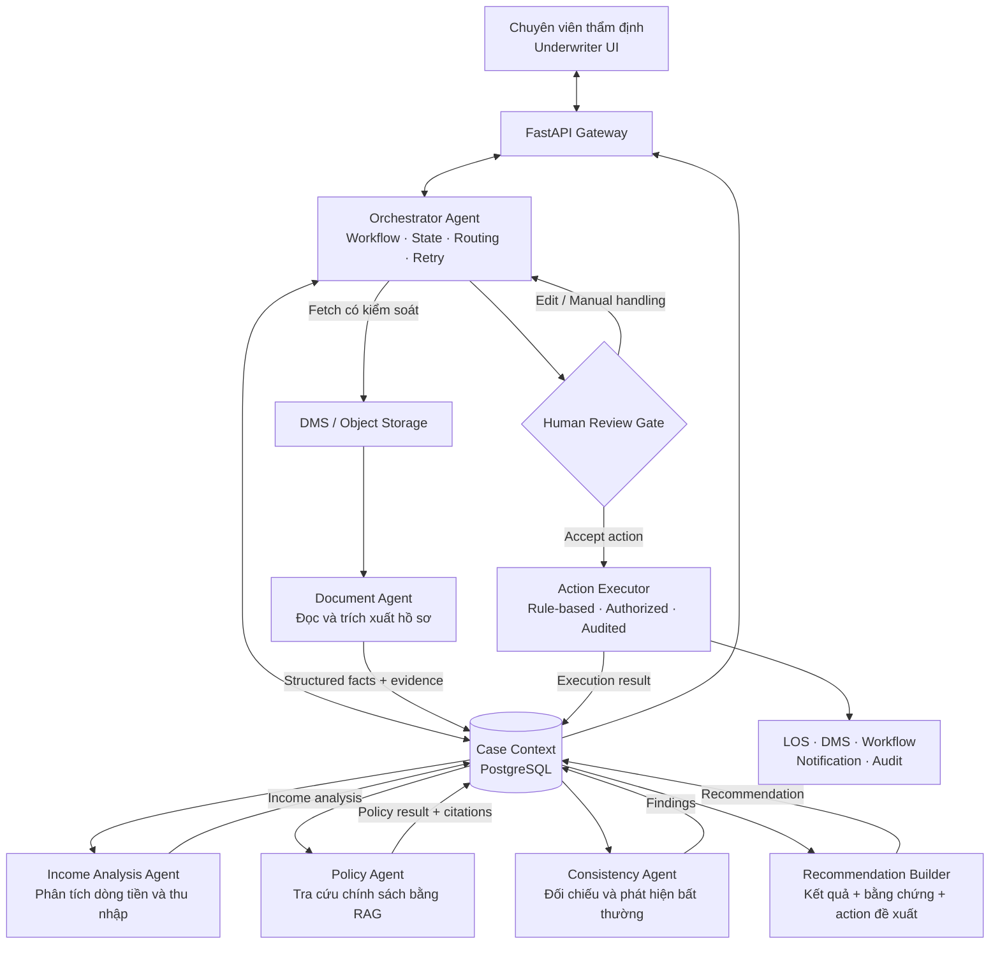
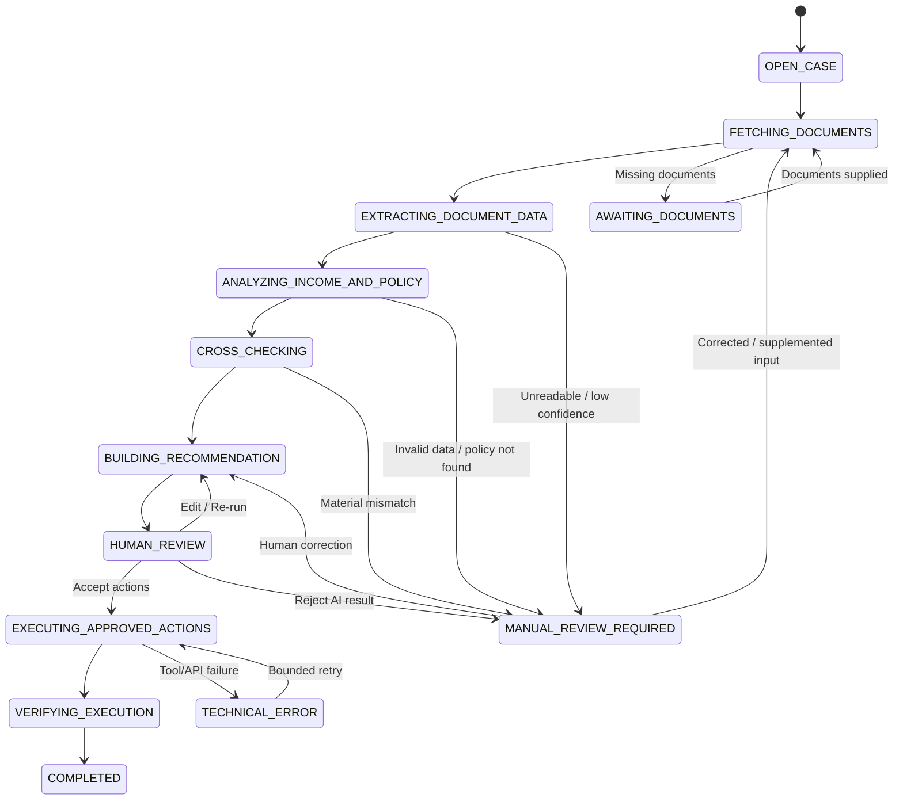
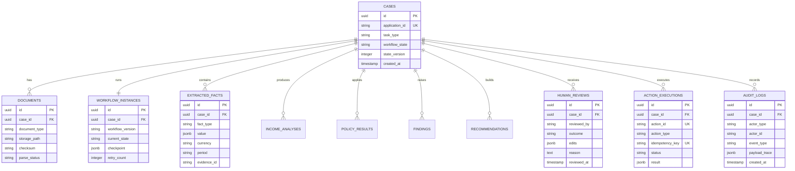

# Kiến trúc hệ thống — Income Verification Expert

**Tên dự án:** Income Verification Expert — Trợ lý xác minh thu nhập tín chấp

**Phiên bản kiến trúc:** 2.0

**Trạng thái:** Approved baseline cho MVP thu hẹp

**Actor duy nhất:** Chuyên viên thẩm định tín chấp

**Task duy nhất:** Kiểm tra và xác minh thu nhập của khách hàng từ bộ hồ sơ vay

---

## 1. Phạm vi và nguyên tắc kiến trúc

Hệ thống hỗ trợ chuyên viên thẩm định đọc hồ sơ, trích xuất dữ liệu, phân tích thu nhập, đối chiếu chính sách, phát hiện điểm thiếu hoặc bất thường và chuẩn bị đề xuất xử lý có bằng chứng. Hệ thống không đưa ra quyết định tín dụng.

Các nguyên tắc bắt buộc:

1. **Orchestrator chỉ điều phối:** quản lý workflow, state, routing, retry và kiểm tra schema; không tự tính thu nhập, diễn giải chính sách hoặc ghi dữ liệu nghiệp vụ chính thức.
2. **Agent chỉ phân tích và đề xuất:** mọi đầu ra phải có schema, trạng thái và bằng chứng nguồn.
3. **Tính toán bằng công cụ xác định:** trung bình, độ biến động, chênh lệch và các chỉ số thu nhập được tính bằng code đã kiểm thử; LLM không tự làm số học.
4. **Chính sách phải có trích dẫn:** Policy Agent không được tự tạo quy tắc khi RAG không tìm thấy nguồn áp dụng.
5. **Human review cho phán đoán và hành động chính thức:** chuyên viên chấp thuận, chỉnh sửa hoặc từ chối kết quả xác minh và action đề xuất; đây không phải quyết định phê duyệt hoặc từ chối khoản vay.
6. **Action Executor tách khỏi agent:** chỉ service rule-based có kiểm tra quyền, trạng thái, idempotency và audit mới được gọi API hệ thống đích.
7. **Case Context là nguồn trạng thái chung:** các agent không gửi prompt tự do trực tiếp cho nhau và không ghi đè vùng dữ liệu thuộc agent khác.
8. **Thiếu bằng chứng thì chuyển người:** không suy đoán giá trị thu nhập, kỳ sao kê, đơn vị công tác hoặc điều kiện chính sách còn thiếu.

---

## 2. Kiến trúc tổng thể



Luồng phân tích độc lập được chạy song song khi đủ đầu vào. Income Analysis Agent chỉ chạy trên dữ liệu đã chuẩn hóa; Policy Agent có thể tra cứu song song sau khi xác định được sản phẩm, loại thu nhập và bộ chứng từ liên quan.

---

## 3. Ranh giới trách nhiệm của các thành phần

### 3.1. Underwriter UI

Frontend Next.js cung cấp một màn hình làm việc tập trung cho chuyên viên:

- mở hồ sơ theo `application_id`;
- bắt đầu tác vụ “Xác minh thu nhập”;
- xem thu nhập khai báo, thu nhập bình quân, thu nhập đủ điều kiện và kỳ dữ liệu;
- xem điểm thiếu, bất thường, policy citation và bằng chứng gốc;
- xem/sửa action do hệ thống đề xuất;
- `Accept`, `Edit` hoặc chuyển `Manual handling` đối với kết quả AI;
- nhập lý do khi sửa hoặc từ chối.

`Accept` tại màn hình này chỉ có nghĩa là chấp thuận kết quả/action của bước xác minh thu nhập. UI không cung cấp thao tác phê duyệt hoặc từ chối khoản vay.

### 3.2. API Gateway

FastAPI chịu trách nhiệm:

- xác thực người dùng và kiểm tra quyền theo hồ sơ;
- validate request/response bằng Pydantic;
- tạo hoặc đọc workflow instance;
- trả state đã được lọc theo quyền cho frontend;
- nhận quyết định human review;
- không chứa logic tính thu nhập hoặc logic chính sách.

### 3.3. Orchestrator Agent

Orchestrator là bộ điều phối, không phải “siêu agent”. Trách nhiệm:

- nhận `application_id` và `task_type=INCOME_VERIFICATION`;
- lấy trạng thái hồ sơ và danh sách tài liệu hiện tại;
- xác định bước/specialist cần chạy theo workflow cố định;
- chạy song song các bước độc lập;
- kiểm tra đầu ra đủ trường và đúng schema;
- retry lỗi kỹ thuật trong giới hạn cấu hình;
- áp dụng routing rules xác định trước;
- checkpoint toàn bộ state và chuyển ngoại lệ sang human review;
- kiểm tra kết quả Action Executor trước khi hoàn tất.

Orchestrator không được:

- tự tính hoặc sửa số liệu thu nhập;
- tự diễn giải chính sách;
- tự gửi thông báo cho khách hàng;
- tự ghi nhận thu nhập chính thức vào LOS;
- tự quyết định khoản vay;
- gọi trực tiếp API mutation của hệ thống đích.

### 3.4. Document Agent

Đầu vào trong MVP:

- đơn vay/phiếu khai thông tin;
- hợp đồng lao động và phụ lục;
- bảng lương hoặc xác nhận lương;
- sao kê tài khoản ngân hàng.

Document Agent thực hiện OCR/đọc tài liệu, phân loại tài liệu, trích xuất trường dữ liệu và liên kết từng giá trị với `evidence_id`. Agent chỉ trích xuất, không kết luận mức thu nhập đủ điều kiện.

Đầu ra tối thiểu:

```json
{
  "customer_name": "Nguyen Van A",
  "declared_income": 25000000,
  "currency": "VND",
  "employer": "ABC Company",
  "contract_salary": 22000000,
  "contract_expiry": "2027-06-30",
  "salary_transactions": [
    {
      "month": "2026-01",
      "amount": 24800000,
      "source": "ABC COMPANY",
      "evidence_id": "statement_p2_row18"
    }
  ],
  "missing_documents": [],
  "extraction_confidence": 0.97
}
```

`extraction_confidence` chỉ phản ánh chất lượng trích xuất kỹ thuật, không phải điểm tín dụng hoặc xác suất hồ sơ được duyệt.

### 3.5. Income Analysis Agent

Income Analysis Agent nhận dữ liệu đã chuẩn hóa và gọi deterministic tools để:

- nhận diện giao dịch lương theo tiêu chí có cấu hình;
- loại trừ giao dịch nội bộ hoặc giao dịch không đủ căn cứ;
- tính thu nhập trung bình trên các kỳ hợp lệ;
- tính độ biến động và độ ổn định;
- phát hiện tháng giảm/tăng bất thường;
- tạo các chỉ số đầu vào cho Policy Agent và Consistency Agent.

Mọi phép tính phải lưu công thức, input, kỳ dữ liệu, currency, quy tắc làm tròn và evidence. Không tự quy đổi currency hoặc bù kỳ thiếu.

### 3.6. Policy Agent

Policy Agent chỉ tra cứu và áp dụng chính sách xác minh thu nhập, ví dụ:

- số tháng sao kê bắt buộc;
- loại thu nhập được tính;
- cách xử lý lương, thưởng và thu nhập không đều;
- yêu cầu về thời hạn hợp đồng lao động;
- điều kiện yêu cầu bổ sung hồ sơ.

Mỗi kết luận phải trả về `document_name`, `page_number`, `section_id`, `effective_date` và đoạn trích nguồn. Nếu không tìm thấy chính sách phù hợp hoặc chính sách hết hiệu lực/mâu thuẫn, trả `POLICY_NOT_FOUND` hoặc `MANUAL_REVIEW_REQUIRED`; tuyệt đối không tạo quy tắc mới.

### 3.7. Consistency Agent

Consistency Agent đối chiếu các đầu ra có cấu trúc:

- thu nhập khai báo với dòng tiền trên sao kê;
- đơn vị công tác với bên chuyển lương;
- lương trên hợp đồng với tiền thực nhận;
- thời gian làm việc/hạn hợp đồng với chính sách;
- danh sách chứng từ hiện có với danh sách bắt buộc;
- kỳ dữ liệu, currency và danh tính giữa các nguồn.

Các phép so sánh số và routing severity dùng rule engine. LLM chỉ được hỗ trợ diễn giải finding dựa trên giá trị đã tính.

### 3.8. Recommendation Builder

Recommendation Builder tổng hợp, không đưa ra quyết định tín dụng. Đầu ra gồm:

- kết quả xác minh sơ bộ;
- thu nhập đủ điều kiện theo policy đã trích dẫn;
- các điểm cần chú ý;
- bằng chứng liên quan;
- action đề xuất;
- mức độ cần human review.

Các trạng thái hợp lệ:

- `READY_FOR_REVIEW`;
- `NEEDS_CLARIFICATION`;
- `MISSING_DOCUMENTS`;
- `POLICY_NOT_FOUND`;
- `MANUAL_REVIEW_REQUIRED`;
- `TECHNICAL_ERROR`.

Không sử dụng `APPROVED` hoặc `REJECTED` làm trạng thái khoản vay.

### 3.9. Human Review Gate

Human Review Gate bắt buộc khi:

- chất lượng trích xuất thấp hơn ngưỡng được cấu hình;
- chênh lệch thu nhập vượt ngưỡng nghiệp vụ;
- không tìm thấy policy/citation phù hợp;
- đơn vị công tác không khớp nguồn chuyển lương;
- thiếu tài liệu bắt buộc;
- agent/tool trả lỗi hoặc kết quả mâu thuẫn;
- có action ghi dữ liệu chính thức hoặc gửi ra ngoài hệ thống.

Các ngưỡng minh họa như `extraction_confidence < 0.90` hoặc chênh lệch `> 10%` phải nằm trong cấu hình/rule version được domain owner phê duyệt, không hard-code trong prompt và không được xem là chính sách thực tế nếu chưa có nguồn.

Phản hồi của chuyên viên được lưu để audit và đánh giá chất lượng. Không tự động dùng phản hồi làm dữ liệu huấn luyện nếu chưa qua phê duyệt và kiểm soát dữ liệu.

### 3.10. Action Executor

Action Executor là application service rule-based, không phải LLM agent. Quy trình bắt buộc:

1. validate action schema;
2. xác thực quyền người yêu cầu/người phê duyệt;
3. kiểm tra trạng thái hồ sơ;
4. kiểm tra idempotency và action trùng;
5. kiểm tra action thuộc permission class nào;
6. gọi adapter của hệ thống đích;
7. xác minh kết quả thực thi;
8. ghi audit log;
9. trả `ExecutionResult` về Orchestrator.

MVP chỉ tích hợp Mock LOS/DMS/Workflow/Notification. Adapter production và mọi irreversible write nằm ngoài phạm vi.

---

## 4. Phân quyền action

| Nhóm | Action | Điều kiện |
| --- | --- | --- |
| Tự động | Lấy tài liệu từ DMS | Read-only, case-scoped, có audit |
| Tự động | Điền draft phiếu xác minh | Chỉ ghi artifact trạng thái `DRAFT`, có thể đảo ngược |
| Tự động | Đính kèm evidence vào draft | Không sửa/xóa tài liệu nguồn |
| Tự động | Tạo task nội bộ/gắn nhãn cần xem xét | Có idempotency, không thay đổi kết quả chính thức |
| Cần chuyên viên xác nhận | Gửi yêu cầu bổ sung hồ sơ | Outbound action |
| Cần chuyên viên xác nhận | Ghi nhận thu nhập đủ điều kiện chính thức | Official LOS write |
| Cần chuyên viên xác nhận | Đóng bước xác minh thu nhập | Official workflow transition |
| Cần chuyên viên xác nhận | Chuyển hồ sơ sang công đoạn tiếp theo | Official workflow transition |
| Cần chuyên viên xác nhận | Ghi chú chính thức vào LOS | Official LOS write |
| Cấm | Phê duyệt/từ chối khoản vay | Ngoài phạm vi |
| Cấm | Thay đổi hạn mức hoặc bỏ qua policy | Ngoài phạm vi |
| Cấm | Sửa/xóa tài liệu nguồn | Ngoài phạm vi |

Action chuẩn hóa:

```json
{
  "action_id": "ACT-00125-03",
  "action_type": "SEND_MISSING_DOCUMENT_REQUEST",
  "application_id": "SHB-2026-00125",
  "parameters": {
    "document_type": "SALARY_ADJUSTMENT_APPENDIX",
    "reason_code": "INCOME_MISMATCH"
  },
  "requires_human_approval": true,
  "approved_by": "underwriter_123",
  "evidence_ids": [
    "employment_contract_p2",
    "statement_may_row15"
  ],
  "idempotency_key": "SHB-2026-00125:SEND_MISSING_DOCUMENT_REQUEST:03"
}
```

---

## 5. Workflow và state machine

### 5.1. Luồng end-to-end



Chi tiết thực thi:

1. Chuyên viên mở hồ sơ và chọn “Xác minh thu nhập”.
2. Orchestrator tạo workflow instance và Case Context.
3. Fetch Tool lấy tài liệu từ Mock DMS/LOS hoặc kho hồ sơ.
4. Document Agent trích xuất dữ liệu và evidence.
5. Income Analysis Agent và Policy Agent chạy song song khi đủ input.
6. Consistency Agent đối chiếu dữ liệu, policy và chứng từ.
7. Recommendation Builder tạo kết quả sơ bộ, evidence và action đề xuất.
8. Rule engine định tuyến hồ sơ đơn giản hoặc ngoại lệ tới human review.
9. Chuyên viên chấp thuận, chỉnh sửa hoặc từ chối kết quả AI.
10. Action Executor thực thi action được phép/đã được duyệt.
11. Orchestrator kiểm tra execution result.
12. Hệ thống ghi audit và hoàn tất tác vụ xác minh thu nhập.

### 5.2. Retry và failure handling

- Chỉ retry lỗi kỹ thuật tạm thời; không retry để “ép” agent tạo kết quả khi thiếu bằng chứng.
- Mỗi node có `max_attempts`, timeout và backoff cấu hình được.
- Workflow checkpoint sau mỗi state transition để có thể resume.
- Lỗi schema không hợp lệ được retry tối đa giới hạn rồi chuyển `MANUAL_REVIEW_REQUIRED`.
- External call dùng idempotency key; kết quả không rõ ràng phải verify trước khi gọi lại.
- Missing documents và policy not found là business exception, không phải technical error.

---

## 6. Case Context dùng chung

`CaseContext` là typed state duy nhất cho workflow. Mỗi component chỉ được cập nhật namespace do mình sở hữu.

```json
{
  "case_id": "0b6cf13a-8bce-4ad2-a2f2-5444e079af1c",
  "application_id": "SHB-2026-00125",
  "task_type": "INCOME_VERIFICATION",
  "workflow_state": "HUMAN_REVIEW",
  "state_version": 7,
  "workflow_version": "income-verification-v1",
  "documents": [],
  "extracted_fields": {},
  "income_analysis": {},
  "policy_results": {},
  "findings": [],
  "evidence": [],
  "recommendation": {},
  "proposed_actions": [],
  "human_review": null,
  "execution_results": [],
  "errors": [],
  "updated_at": "2026-07-18T10:00:00Z"
}
```

Quy tắc cập nhật:

- optimistic locking bằng `state_version` hoặc transaction lock;
- append-only cho evidence, audit và execution history;
- không lưu customer PII vào policy embedding hoặc long-term LLM memory;
- mọi fact chứa `source_document_id`, trang/vùng dữ liệu và `evidence_id`;
- mọi derived metric chứa input fact IDs và calculation version;
- mọi policy result chứa citation và policy version/effective date.

---

## 7. Data, storage và RAG

### 7.1. Các vùng lưu trữ

- **PostgreSQL:** case metadata, workflow checkpoint, structured facts, analysis, findings, review, action và audit.
- **MinIO/S3 hoặc Mock DMS:** tài liệu gốc và artifact draft, tách đường dẫn theo `case_id`.
- **pgvector:** chỉ lưu chính sách nội bộ đã kiểm duyệt; embedding dùng FPT `Vietnamese_Embedding`, 512 chiều theo cấu hình hiện tại.
- **Không đưa customer documents vào global policy index.** Nếu cần tìm kiếm evidence, phải dùng kho case-scoped và filter bắt buộc theo `case_id`.

### 7.2. Policy RAG

Policy query bắt buộc lọc theo:

- `domain = INCOME_VERIFICATION`;
- `product = UNSECURED_PERSONAL_LOAN`;
- `chunk_type IN (POLICY_RULE, VERIFICATION_PROCEDURE)`;
- phiên bản/ngày hiệu lực phù hợp;
- trạng thái tài liệu đã được phê duyệt.

Citation tối thiểu:

```json
{
  "document_name": "Income Verification Policy v3.2",
  "page_number": 12,
  "section_id": "4.2.1",
  "effective_date": "2026-01-01",
  "quote": "...",
  "chunk_id": "policy-chunk-981"
}
```

Nếu RAG trả về nhiều quy tắc mâu thuẫn, Policy Agent không tự chọn. Kết quả phải ghi nhận conflict và chuyển human review.

### 7.3. Logical data model



---

## 8. API và integration boundary

API nghiệp vụ mục tiêu:

| Method | Endpoint | Mục đích |
| --- | --- | --- |
| `POST` | `/api/v1/applications/{application_id}/income-verification` | Tạo/resume workflow xác minh |
| `GET` | `/api/v1/income-verifications/{case_id}` | Đọc Case Context cho UI |
| `POST` | `/api/v1/income-verifications/{case_id}/review` | Gửi approve/edit/reject của chuyên viên |
| `GET` | `/api/v1/income-verifications/{case_id}/evidence/{evidence_id}` | Mở bằng chứng theo quyền |
| `GET` | `/api/v1/income-verifications/{case_id}/audit` | Xem audit trace được phép |

Adapters tích hợp phải dùng interface typed:

- `DocumentRepository` cho DMS/MinIO;
- `LoanOriginationGateway` cho LOS;
- `WorkflowGateway` cho task/queue;
- `NotificationGateway` cho yêu cầu bổ sung;
- `AuditSink` cho audit trail.

Trong MVP, mọi gateway dùng mock adapter. Không để agent biết endpoint, credential hoặc tự tạo payload mutation.

---

## 9. Cấu trúc thư mục mục tiêu

Đây là target architecture; code hiện tại cần được migration theo từng phase, không giả định đã hoàn tất.

```text
frontend/src/
├── app/income-verifications/
├── features/income-verification/
│   ├── components/
│   ├── hooks/
│   └── types/
└── shared/

backend/app/
├── api/v1/
│   └── income_verifications.py
├── agents/
│   └── income_verification/
│       ├── orchestrator.py
│       ├── state.py
│       ├── document_agent.py
│       ├── income_agent.py
│       ├── policy_agent.py
│       ├── consistency_agent.py
│       └── recommendation_builder.py
├── tools/
│   ├── income_calculator.py
│   ├── consistency_rules.py
│   └── routing_rules.py
├── services/
│   ├── action_executor.py
│   ├── rag.py
│   ├── storage.py
│   └── integrations/
│       ├── dms.py
│       ├── los.py
│       ├── workflow.py
│       └── notification.py
├── db/
│   ├── models.py
│   └── session.py
└── mock_apis/
```

---

## 10. Audit, bảo mật và khả năng kiểm thử

- Mọi agent execution, state transition, policy query, human review và action execution đều có audit event.
- Audit ghi actor, timestamp, workflow version, input/output reference, rule/calculation version và result; không ghi secret.
- Truy cập tài liệu/evidence phải kiểm tra quyền theo `case_id` và `application_id`.
- PII được mã hóa khi truyền và khi lưu; log hiển thị phải mask dữ liệu nhạy cảm.
- Prompt/tool input phải chống trộn dữ liệu giữa hồ sơ; không cache kết quả khách hàng dùng chung.
- Unit test bắt buộc cho phép tính, routing rules, permission matrix, schema và idempotency.
- Contract test cho mock LOS/DMS/Workflow/Notification.
- Workflow test phải bao phủ happy path, thiếu tài liệu, policy not found, mismatch, retry và action trùng.

---

## 11. Ngoài phạm vi

- phê duyệt hoặc từ chối khoản vay;
- chấm điểm tín dụng tổng thể;
- KYC/AML, pháp lý, rủi ro ngành hoặc tài sản bảo đảm;
- DSCR, D/E, LTV và phân tích tài chính doanh nghiệp;
- thay đổi hạn mức, giải ngân hoặc tạo hợp đồng tín dụng;
- bỏ qua/ghi đè chính sách;
- sửa hoặc xóa tài liệu nguồn;
- ghi trực tiếp vào hệ thống production trong MVP;
- tự động huấn luyện model từ phản hồi chuyên viên;
- giao tiếp trực tiếp với khách hàng khi chưa có human approval.

---

## 12. Tóm tắt quyết định kiến trúc

> Orchestrator quản lý workflow; các specialist agent tạo kết quả và bằng chứng có cấu trúc; chuyên viên xử lý những trường hợp cần phán đoán và xác nhận hành động chính thức; Action Executor thực thi action được cho phép trên Mock LOS/DMS với kiểm soát quyền, idempotency và audit đầy đủ.
