# Product Requirements Document (PRD) - Digital Expert Agents

**Version:** 1.1.0  
**Status:** Approved  
**Author:** Senior Software Architect  

---

## 1. Problem Statement
The current process for corporate loan application assessments is manually intensive, involving multiple departments (Credit, Risk, Legal, Operations, etc.), causing delays and inconsistencies. 

**Digital Expert Agents** is a multi-agent AI system that automates the preliminary assessment of corporate loan applications. The system uses a central orchestrator to coordinate specialized agents representing the Customer Relationship Department, Credit Department, Risk Management Department, Legal & Compliance Department, Collateral Appraisal Department, and Banking Operations Department. The agents retrieve internal knowledge through RAG, use approved tools, collaborate through structured JSON outputs on a **Shared Board**, and produce a consolidated assessment for human verification. 

> [!IMPORTANT]
> The system **does not** automatically approve or reject loans. It assists human banking employees by providing structured insights and executing operational tasks *only* after human verification.

---

## 2. Core Features (MVP Scope & 3-Tier Architecture)

The MVP is structured around a strict **3-Tier Multi-Agent Pipeline**: `Tier 1: Banking Orchestrator (Deep Agent)` $\rightarrow$ `Tier 2: Specialist & Reviewer/Debate Collaboration via Shared Board` $\rightarrow$ `Tier 3: Human Verification & Operations Agent`.

### 2.1. Tier 1: Banking Orchestrator (Deep Agent)
The `Banking Orchestrator` is a LangChain/LangGraph **Deep Agent** responsible for end-to-end cognitive control:
*   **Understand Requirements (`Hiểu yêu cầu`):** Parses initial loan application goals, requested term sheets, and uploaded file types.
*   **Determine Workflow (`Xác định workflow`):** Maps out the execution path based on company tier and loan complexity.
*   **Task Decomposition (`Chia nhỏ nhiệm vụ`):** Breaks the assessment into granular analytical sub-tasks (e.g., DSCR calculation, KYC check, collateral evaluation).
*   **Expert Agent Selection (`Chọn expert agent`):** Dispatches specific sub-tasks to the appropriate specialist agents (`Customer Relationship`, `Credit`, `Risk Management`, `Legal & Compliance`, `Collateral Appraisal`).
*   **Task Tracking (`Theo dõi task`):** Monitors execution status across parallel sub-agent workers.
*   **Dynamic Re-planning (`Re-plan khi thiếu dữ liệu`):** If a specialist agent reports missing or unreadable documents, the Orchestrator pauses, re-plans, or requests specific supplementary documents.
*   **Result Synthesis (`Tổng hợp kết quả`):** Consolidates the final state from the Shared Board into a unified assessment draft for Tier 3 verification.

### 2.2. Tier 2: Specialist Agents & Reviewer/Debate Agent (Shared Board Pattern)
In Tier 2, specialist agents run concurrently and collaborate via a **Shared Board** (a centralized state memory / blackboard):
*   **Shared Board:** All specialist agents post their interim outputs, calculated financial metrics, identified risks, and RAG policy citations onto the Shared Board.
*   **Specialist Agents (Parallel Execution):**
    *   **Customer Relationship Agent:** Extracts borrower profile, requested loan parameters (amount, interest rate, maturity), and business model background.
    *   **Credit Agent:** Analyzes financial statements, calculates Debt Service Coverage Ratio (DSCR), Current Ratio, and Leverage (D/E).
    *   **Risk Management Agent:** Evaluates industry risk factors, checks against credit policies (e.g., maximum concentration limit), and assigns a preliminary risk tier (Low, Medium, High).
    *   **Legal & Compliance Agent:** Performs KYC verification, corporate governance checks, anti-money laundering (AML) screening, and sanctions list checks.
    *   **Collateral Appraisal Agent:** Assesses collateral assets (real estate, equipment, inventory) and computes the Loan-to-Value (LTV) ratio.
*   **Reviewer Agent (Debate Agent):**
    *   Acts as the quality controller and adversarial challenger within Tier 2.
    *   **Error Detection & Debate (`Tìm lỗi sai & Debate`):** Inspects the Shared Board, identifies discrepancies, logical flaws, or unsupported claims across specialist outputs (e.g., Credit Agent claiming low risk while Compliance Agent flags pending regulatory litigation).
    *   **Iterative Improvement (`Improve output`):** Critiques flawed sub-agent findings and triggers re-evaluation rounds on the Shared Board until consensus or maximum debate rounds are reached.

### 2.3. Tier 3: Human Verification & Operations Agent
*   **Human Verification Console (Next.js UI):**
    *   Displays the final synthesized assessment from Tier 1/Tier 2.
    *   Shows exact agent reasoning, debate history from the Reviewer Agent, and clickable RAG policy citations.
    *   Banking Officer reviews and selects: `Approve`, `Reject`, or `Request Revision with Feedback`.
*   **Operations Agent (Post-Approval Execution):**
    *   Triggered **only after explicit human approval** in Tier 3.
    *   Executes read-only/pre-onboarding actions and generates draft onboarding packages via **Mock SHB Core Banking APIs**.

---

## 3. Out of Scope (strictly excluded from v1)

*   **Automated Decisioning:** The system will not automatically approve, reject, or disburse loans without manual human intervention.
*   **Direct Core Banking Write-Back:** System will not execute API mutations to change records in production core banking systems. It only communicates with Mock SHB APIs or exports structured payloads/draft PDFs.
*   **Direct Customer Communication:** The system will not send emails, SMS, or notifications directly to corporate loan applicants.
*   **Fine-Tuning of Models:** Custom LLM fine-tuning is out of scope; all agents utilize pre-trained models via API with deep agent scaffolding.
*   **Real-time External APIs:** External live scraping of corporate registries is out of scope; inputs come from uploaded docs or static mock databases.

---

## 4. Main User Flow (3-Tier Pipeline)

```mermaid
sequenceDiagram
    autonumber
    actor Officer as Banking Officer
    participant FE as Next.js Frontend
    participant Tier1 as Tier 1: Orchestrator (Deep Agent)
    participant Board as Shared Board (State/DB)
    participant Tier2 as Tier 2: Specialists & Reviewer (Debate)
    participant Tier3 as Tier 3: Operations Agent

    Officer->>FE: Upload loan docs & trigger evaluation
    FE->>Tier1: Initialize assessment (Session ID)
    Tier1->>Tier1: Understand, Plan workflow & Decompose tasks
    Tier1->>Board: Initialize Shared Board with task breakdown
    
    rect rgb(20, 30, 45)
        Note over Tier1, Tier2: Tier 2: Parallel Specialists & Reviewer Debate Loop
        Tier1->>Tier2: Dispatch parallel tasks (Credit, Compliance, Legal)
        Tier2->>Board: Post initial findings, metrics & RAG citations
        Tier2 (Reviewer)->>Board: Debate & find errors/contradictions in outputs
        Tier2 (Reviewer)->>Tier2: Prompt Specialists to refine output
        Tier2->>Board: Post improved consensus assessment
    end
    
    Tier1->>Board: Read final verified state & synthesize report
    Tier1->>FE: Present consolidated assessment & debate log
    
    rect rgb(30, 40, 20)
        Note over Officer, Tier3: Tier 3: Human Verification & Operational Execution
        Officer->>FE: Verify citations, audit debate log & Approve
        FE->>Tier3: Trigger approved operational tasks
        Tier3->>FE: Return generated draft agreements & onboarding JSON
    end
```



---

## 5. Concrete Structured Data Example (Shared Board Schema)

To enable Tier 2 collaboration, all specialist and reviewer interactions read and write to a standardized `Shared Board` JSON schema:

```json
{
  "boardId": "board_case_2026_881",
  "caseId": "loan_corp_99823",
  "status": "DEBATE_IN_PROGRESS",
  "iterationRound": 2,
  "tasks": {
    "credit_analysis": { "status": "COMPLETED", "assignedTo": "CreditAgent" },
    "compliance_check": { "status": "REFINING", "assignedTo": "ComplianceAgent" },
    "legal_review": { "status": "COMPLETED", "assignedTo": "LegalAgent" }
  },
  "specialistOutputs": {
    "CreditAgent": {
      "DSCR": 1.42,
      "Leverage": 2.1,
      "conclusion": "Financial strength acceptable. Meets DSCR policy > 1.25x."
    },
    "ComplianceAgent": {
      "kycStatus": "VERIFIED",
      "amlRisk": "MEDIUM",
      "flag": "Subsidiary entity has pending inquiry in local registry."
    }
  },
  "reviewerDebateLog": [
    {
      "round": 1,
      "critic": "ReviewerAgent",
      "target": "CreditAgent",
      "issueFound": "Credit assessment did not factor in potential contingent liabilities from ComplianceAgent's flagged subsidiary inquiry.",
      "requiredAction": "Recalculate stressed DSCR assuming a $250k legal contingency."
    },
    {
      "round": 2,
      "respondent": "CreditAgent",
      "resolution": "Stressed DSCR recalculated to 1.28x. Still satisfies minimum threshold."
    }
  ],
  "finalConsensusReached": true
}
```
