# Product Requirements Document (PRD) - Digital Expert Agents

**Version:** 1.0.0  
**Status:** Approved  
**Author:** Senior Software Architect  

---

## 1. Problem Statement
The current process for corporate loan application assessments is manually intensive, involving multiple departments (Credit, Risk, Legal, Operations, etc.), causing delays and inconsistencies. 

**Digital Expert Agents** is a multi-agent AI system that automates the preliminary assessment of corporate loan applications. A central orchestrator coordinates specialized agents retrieving internal knowledge via Retrieval-Augmented Generation (RAG), utilizing tools, and collaborating using structured JSON outputs to generate a consolidated preliminary assessment. 

> [!IMPORTANT]
> The system **does not** automatically approve or reject loans. It assists human banking employees by providing structured insights and executing operational tasks *only* after human verification.

---

## 2. Core Features (MVP Scope)

The MVP is strictly limited to the following core capabilities:

### 2.1. Multi-Agent Orchestration & Core Agents
A pipeline running sequentially and in parallel: `Orchestrator` $\rightarrow$ `Specialist Agents` (parallel) $\rightarrow$ `Reviewer` $\rightarrow$ `Human Verification` $\rightarrow$ `Operations Agent`.

*   **Central Orchestrator:**
    *   Initiates assessment runs.
    *   Distributes tasks to specialist agents using custom tool wrappers.
    *   Aggregates departmental reports and handles step execution retries.
*   **Customer Relationship Agent:**
    *   Extracts borrower details, industry, business model, and requested loan term sheet parameters (amount, interest rate, maturity).
*   **Credit Agent:**
    *   Analyzes balance sheet, income statement, and cash flow documents.
    *   Calculates key credit metrics: Debt Service Coverage Ratio (DSCR), Debt-to-Equity (D/E), and Current Ratio.
*   **Risk Management Agent:**
    *   Evaluates industry risk factors, checks against credit policies (e.g., maximum concentration limit), and assigns a preliminary risk tier (Low, Medium, High).
*   **Legal & Compliance Agent:**
    *   Performs KYC verification, Sanctions list checks, and anti-money laundering (AML) screening based on provided registry inputs.
*   **Collateral Appraisal Agent:**
    *   Assesses collateral details (e.g., real estate, machinery) and computes the Loan-to-Value (LTV) ratio.
*   **Reviewer Agent:**
    *   Synthesizes individual agent outputs into a standardized JSON report.
    *   Flags conflicting inputs (e.g., Credit Agent notices strong cash flow while Risk Agent notes industry decline).
*   **Operations Agent:**
    *   Executes read-only banking pre-checks and generates draft operational outputs (e.g., loan onboarding JSON and draft credit agreement PDF) only when triggered by human verification.

### 2.2. Retrieval-Augmented Generation (RAG)
*   Retrieval of internal credit guidelines, regulatory frameworks, risk assessment policies, and historical assessment templates.
*   Source citations must link to specific sections of referenced internal guidelines.

### 2.3. Frontend Dashboard (Human-in-the-Loop)
*   **Workspace & Inbox:** View list of pending and completed loan assessments.
*   **Assessment Details Page:** Side-by-side view showing extracted financials, calculated ratios, department agent comments with RAG citations, and conflict alerts.
*   **Human Verification Console:** Approve, modify, or reject the agent recommendations. A text field must capture employee feedback if returning to agents.
*   **Operational Execution Trigger:** A manual action button that dispatches a command to the `Operations Agent` to generate the final loan onboarding package.

---

## 3. Out of Scope (strictly excluded from v1)

The following features must not be proposed, designed, or implemented in the current scope:
*   **Automated Decisioning:** The system will not automatically approve, reject, or disburse loans without manual human intervention.
*   **Direct Core Banking Write-Back:** System will not execute API mutations to change records in production core banking systems (e.g., credit line creation, actual fund disbursement). It will only export structured payloads or draft PDFs.
*   **Direct Customer Communication:** The system will not send emails, SMS, or notifications directly to corporate loan applicants.
*   **Fine-Tuning of Models:** Custom LLM fine-tuning is out of scope; all models will use standard pre-trained models via API with context/system prompt modifications.
*   **Real-time External APIs:** External scraping of live corporate registers (e.g., SEC EDGAR, local trade registers) or live credit bureaus. All inputs must come from uploaded documents or static mock databases.

---

## 4. Main User Flow

```mermaid
sequenceDiagram
    autonumber
    actor Officer as Banking Officer
    participant FE as Next.js Frontend
    participant Orch as Orchestrator
    participant Agents as Specialist Agents
    participant Rev as Reviewer Agent
    participant Ops as Operations Agent

    Officer->>FE: Upload corporate loan application docs (PDF/Excel)
    FE->>Orch: Trigger loan assessment run (Session ID)
    rect rgb(20, 20, 30)
        Note over Orch, Agents: Parallel Execution Phase
        Orch->>Agents: Delegate task payloads (w/ RAG reference keys)
        Agents->>Orch: Return structured JSON assessments
    end
    Orch->>Rev: Synthesize assessments & find conflicts
    Rev->>Orch: Return Consolidated Assessment JSON
    Orch->>FE: Update UI with consolidated report
    Officer->>FE: Review reports, RAG sources, and resolve flags
    alt Action: Reject or Needs Revision
        Officer->>FE: Submit revision request with feedback
        FE->>Orch: Re-run orchestrator with human feedback
    else Action: Approve
        Officer->>FE: Trigger operational execution
        FE->>Ops: Execute operations tasks
        Ops->>FE: Return generated credit draft PDF & onboarding payload
        FE->>Officer: Show success screen and download links
    end
```



### Step-by-Step User Journey

#### Step 1: Application Ingest
*   The Banking Officer logs in and navigates to "New Assessment".
*   Uploads PDF files (Borrower Profile, Audited Financial Statements, Credit Request Details, Collateral Property Appraisal).
*   System creates a record in the database with status `INGESTED`.

#### Step 2: Agent Processing
*   The system schedules the `Orchestrator`.
*   The `Orchestrator` triggers the specialist agents in parallel:
    *   *Credit Agent* extracts numeric tables, computes metrics, and compares DSCR against threshold (e.g., $>1.25x$).
    *   *Risk Agent* evaluates compliance rules.
*   The `Reviewer Agent` analyzes all agent JSON outputs and formats the unified assessment report.
*   System sets state to `PENDING_REVIEW`.

#### Step 3: Human Verification
*   The Banking Officer reviews the "Assessment Details Page".
*   The officer views the credit score, calculations, compliance results, and conflict flags.
*   The officer clicks on a risk flag (e.g., "LTV exceeds 80%") and views the RAG citation citing "Section 4.2 of the Credit Policy".
*   The officer modifies values if necessary and clicks **"Approve Assessment"**.

#### Step 4: Operational Execution
*   On approval, the system issues a command payload to the `Operations Agent`.
*   The `Operations Agent` generates the `Draft_Credit_Agreement.pdf` and compiles the `Core_Banking_Onboarding.json` data package.
*   The Banking Officer downloads the documents, and the assessment record moves to `COMPLETED`.

---

## 5. Concrete Structured Data Example (Developer Reference)

To ensure interoperability between the Orchestrator, Specialist Agents, and Reviewer Agent, all communication must strictly conform to structured schemas.

### Example Orchestrator to Credit Agent Task Schema
```json
{
  "taskId": "task_credit_analysis_001",
  "loanId": "loan_corp_99823",
  "documents": [
    { "type": "financial_statement_pdf", "path": "/shared/docs/corp_99823_fs2025.pdf" }
  ],
  "parameters": {
    "requiredRatios": ["DSCR", "Leverage", "CurrentRatio"],
    "minimumDSCR": 1.25
  }
}
```

### Example Credit Agent Output Schema
```json
{
  "taskId": "task_credit_analysis_001",
  "status": "SUCCESS",
  "metrics": {
    "DSCR": 1.42,
    "Leverage": 2.1,
    "CurrentRatio": 1.65
  },
  "flags": [],
  "evidence": [
    {
      "finding": "Net Operating Income of $1.42M covers debt service of $1.0M.",
      "pageReference": 14,
      "document": "corp_99823_fs2025.pdf"
    }
  ]
}
```
