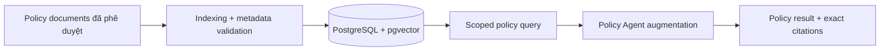
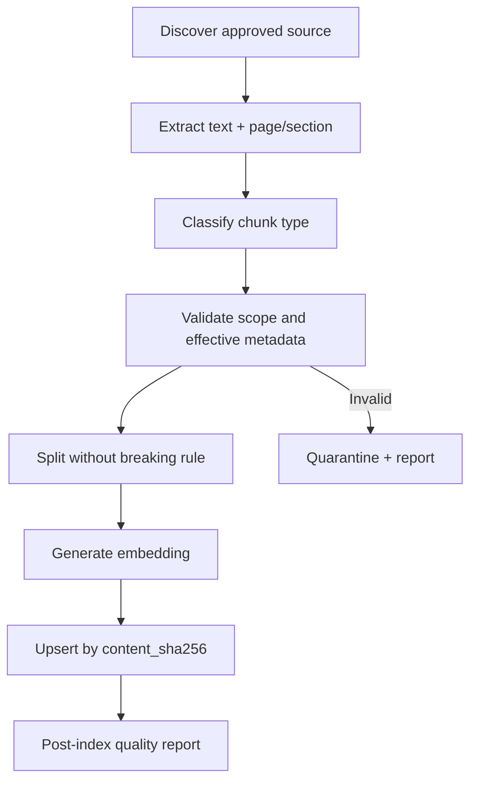

# Kiến trúc RAG — Income Verification Expert

**Dự án:** Income Verification Expert — Trợ lý xác minh thu nhập tín chấp

**Phiên bản:** 2.0

**Phạm vi:** Tra cứu chính sách phục vụ duy nhất tác vụ xác minh thu nhập tín chấp cá nhân

---

## 1. Mục tiêu

RAG cung cấp cho Policy Agent đúng quy tắc xác minh thu nhập đang có hiệu lực và citation có thể kiểm tra lại. RAG không tính thu nhập, không chứa dữ liệu khách hàng và không đưa ra quyết định tín dụng.

Pipeline gồm ba giai đoạn:



## 2. Tách biệt policy và customer evidence

### 2.1. Global policy index

`policy_embeddings` chỉ lưu tài liệu chính sách/quy trình nội bộ đã được domain owner phê duyệt. Mỗi chunk phải có metadata đủ để xác định phạm vi và hiệu lực.

Không được đưa vào global index:

- đơn vay, hợp đồng lao động, bảng lương hoặc sao kê của khách hàng;
- PII, số tài khoản hoặc dữ liệu giao dịch;
- output của agent;
- phản hồi chuyên viên chưa qua kiểm soát;
- tài liệu không rõ nguồn, trạng thái hoặc ngày hiệu lực.

### 2.2. Case evidence store

Tài liệu khách hàng được lưu trong DMS/MinIO theo đường dẫn cô lập `case_id`. Structured facts và evidence pointers được lưu trong PostgreSQL/Case Context.

Nếu cần tìm kiếm trong hồ sơ, query bắt buộc có `case_id` và quyền người dùng. Customer evidence không dùng chung bảng/vector namespace với policy.

## 3. Taxonomy

### 3.1. Chunk trong policy index

Target MVP sử dụng hai loại chunk:

#### `POLICY_RULE`

Dùng cho quy tắc có điều kiện, ngưỡng, ngoại lệ và consequence, ví dụ:

- số kỳ sao kê yêu cầu;
- loại thu nhập được tính;
- cách xử lý thưởng/thu nhập không đều;
- điều kiện thời hạn hợp đồng;
- điều kiện yêu cầu bổ sung hồ sơ.

Một chunk phải giữ trọn vẹn:

```text
scope + condition + rule/threshold + exception + required action
```

Không cắt giữa điều/khoản hoặc tách ngoại lệ khỏi rule chính.

#### `VERIFICATION_PROCEDURE`

Dùng cho bước nghiệp vụ xác minh thu nhập:

```json
{
  "step": "Kiểm tra đủ kỳ sao kê",
  "inputs": ["BANK_STATEMENT"],
  "checks": ["period_coverage", "account_owner"],
  "output": "DOCUMENT_SET_STATUS",
  "exception": "Chuyển MISSING_DOCUMENTS nếu thiếu kỳ"
}
```

Procedure chỉ mô tả xử lý của bước xác minh; không chứa phê duyệt khoản vay, giải ngân hoặc vận hành tài sản bảo đảm.

### 3.2. Dữ liệu case không embedding toàn cục

Hai loại record được lưu case-scoped:

- `DOCUMENT_EVIDENCE`: đoạn/vùng nguồn kèm document, page, bounding box/row và checksum;
- `STRUCTURED_FACT`: fact đã chuẩn hóa kèm value, currency, period và `evidence_id`.

Ví dụ:

```json
{
  "case_id": "case-00125",
  "fact_type": "SALARY_TRANSACTION",
  "period": "2026-01",
  "value": 24800000,
  "currency": "VND",
  "evidence_id": "statement_p2_row18"
}
```

Derived metrics không được embedding để dùng làm sự thật nguồn. Income calculator phải tái tạo được metric từ structured facts.

## 4. Metadata bắt buộc

Mỗi policy chunk phải có:

```json
{
  "chunk_id": "policy-chunk-981",
  "chunk_type": "POLICY_RULE",
  "domain": "INCOME_VERIFICATION",
  "product": "UNSECURED_PERSONAL_LOAN",
  "document_name": "Income Verification Policy v3.2",
  "document_version": "3.2",
  "page_number": 12,
  "section_id": "4.2.1",
  "effective_date": "2026-01-01",
  "expiry_date": null,
  "approval_status": "APPROVED",
  "content_sha256": "...",
  "source_path": "..."
}
```

Chunk thiếu `document_name`, `page_number`, `section_id`, `effective_date`, domain/product hoặc approval status bị loại khỏi production index.

## 5. Indexing pipeline



Quy tắc indexing:

- chỉ index `INCOME_VERIFICATION` và `UNSECURED_PERSONAL_LOAN` cho target MVP;
- dùng checksum để upsert idempotent;
- index và runtime query dùng cùng provider/model/dimension;
- tài liệu hết hiệu lực không bị xóa lịch sử nhưng không được trả về cho query tại ngày sau expiry;
- tài liệu mâu thuẫn hoặc nguồn ngoài chưa duyệt được quarantine;
- báo cáo ingestion không chứa secret hoặc raw customer data.

## 6. Query contract

Policy Agent không được search toàn bảng. Query bắt buộc nhận:

```python
from datetime import date
from typing import Literal
from pydantic import BaseModel, Field


class PolicyQuery(BaseModel):
    query_text: str = Field(min_length=3)
    domain: Literal["INCOME_VERIFICATION"]
    product: Literal["UNSECURED_PERSONAL_LOAN"]
    chunk_types: list[Literal["POLICY_RULE", "VERIFICATION_PROCEDURE"]]
    as_of_date: date
    top_k: int = Field(default=5, ge=1, le=10)
```

Filter logic tương đương:

```sql
WHERE metadata->>'domain' = :domain
  AND metadata->>'product' = :product
  AND metadata->>'chunk_type' = ANY(:chunk_types)
  AND metadata->>'approval_status' = 'APPROVED'
  AND (metadata->>'effective_date')::date <= :as_of_date
  AND (
      metadata->>'expiry_date' IS NULL
      OR (metadata->>'expiry_date')::date >= :as_of_date
  )
ORDER BY embedding <=> CAST(:query_vector AS vector)
LIMIT :top_k
```

Không được bỏ filter để tăng số kết quả. Nếu không đủ evidence, trả `POLICY_NOT_FOUND`.

## 7. Policy Agent augmentation

Policy Agent nhận:

- normalized case attributes cần đối chiếu;
- query scope cố định;
- các policy chunks đã qua filter;
- citation metadata.

Policy Agent được phép:

- chọn đoạn liên quan trong tập đã truy xuất;
- diễn giải rule theo structured output;
- tạo policy result kèm citation;
- báo conflict hoặc thiếu policy.

Policy Agent không được phép:

- tự đặt ngưỡng;
- dùng kiến thức model thay cho policy evidence;
- tính số học từ giao dịch;
- sửa structured facts;
- chọn policy ngoài product/domain/ngày hiệu lực;
- kết luận khoản vay được duyệt hoặc bị từ chối.

## 8. Citation contract

Mọi policy conclusion phải có:

```json
{
  "document_name": "Income Verification Policy v3.2",
  "page_number": 12,
  "section_id": "4.2.1",
  "effective_date": "2026-01-01",
  "quote": "...",
  "chunk_id": "policy-chunk-981"
}
```

UI phải mở được citation đúng tài liệu/trang theo quyền. Quote dùng để xác minh, không thay thế source document.

## 9. Zero-hallucination và conflict handling

- Không tìm thấy rule phù hợp → `POLICY_NOT_FOUND`.
- Rule hết hiệu lực → không áp dụng; tìm phiên bản hợp lệ hoặc chuyển người.
- Nhiều rule mâu thuẫn → `MANUAL_REVIEW_REQUIRED` kèm danh sách citations.
- Citation thiếu metadata → không được dùng cho kết luận.
- Case fact thiếu evidence → không đưa vào tính toán/policy comparison.
- Không tự suy đoán số kỳ, tỷ lệ thưởng, thời hạn hợp đồng hoặc consequence.

## 10. Code mapping mục tiêu

| Chức năng | Target module |
| --- | --- |
| Policy ingestion/chunking | `backend/app/services/rag.py` và scripts ingestion |
| Embedding provider | `backend/app/services/embeddings.py` |
| Policy persistence | `backend/app/db/models.py` |
| Policy query | `backend/app/services/rag.py` |
| Policy reasoning | `backend/app/agents/income_verification/policy_agent.py` |
| Case facts/evidence | `backend/app/agents/income_verification/state.py` và DB models |
| Evidence retrieval | DMS/MinIO adapter, luôn filter `case_id` |

Các path `tier2_board/specialists/credit.py`, `legal.py`, `compliance.py` là legacy và không phải target của Income Verification Expert.

## 11. Embedding configuration

Cấu hình hiện tại:

```text
EMBEDDING_PROVIDER=fpt
EMBEDDING_MODEL=Vietnamese_Embedding
EMBEDDING_DIMENSIONS=512
```

Không trộn vector được tạo bởi provider/model/dimension khác nhau trong cùng index. `mock` provider chỉ dùng cho automated test, không dùng làm production retrieval data.

Không ghi API key vào command output, log, docs hoặc source.

## 12. Kiểm thử và quality gates

Test bắt buộc:

- metadata validation và quarantine;
- chunk không cắt mất condition/exception;
- filter domain/product/chunk type/effective date;
- expired policy không được trả về;
- empty result trả `POLICY_NOT_FOUND`;
- conflicting policies chuyển manual review;
- citation đầy đủ và mở được source;
- index/upsert idempotent theo checksum;
- query không truy xuất customer PII hoặc case khác;
- embedding dimension mismatch bị chặn.

RAG chỉ được coi là sẵn sàng cho MVP khi corpus chính sách xác minh thu nhập đã được domain owner duyệt và benchmark retrieval đạt tiêu chí được thống nhất.
