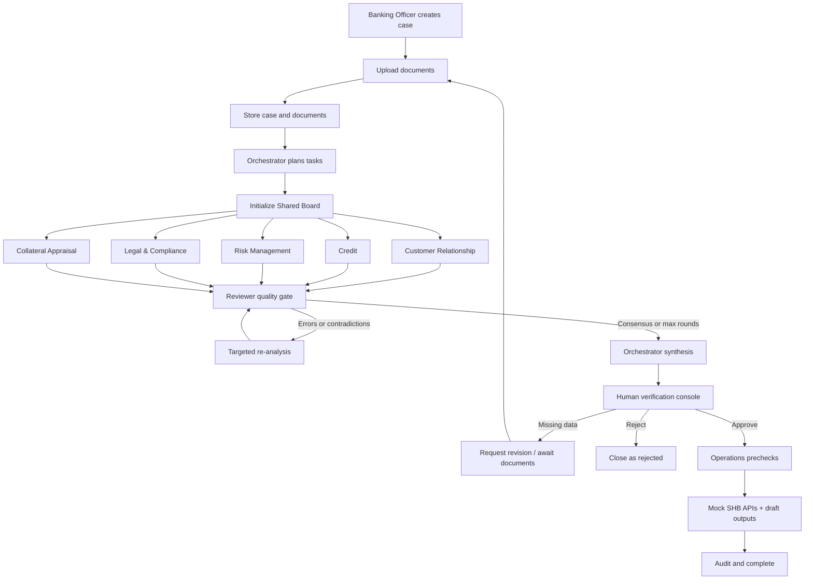

# Digital Expert Agents Workflow

This document is the operational source of truth for the MVP workflow. It covers both the application runtime and the development workflow used by Codex/team members.

## 1. Runtime workflow



### 1.1 Case intake

1. The officer creates a `Case` with company name, requested amount, currency, and initial status `INGESTED`.
2. Documents are uploaded through the API and stored in MinIO under a case-isolated path.
3. Each document is linked to the case in `documents` and receives an audit event.
4. Reject unsupported, empty, or unreadable files early. Do not start analysis with an incomplete document set without recording the gap.

### 1.2 Evidence preparation and RAG

1. Extract text and structured facts from case documents while retaining `case_id`, filename, page, and section metadata.
2. Keep customer evidence isolated from the global policy index. Policy embeddings contain internal guidance, not customer PII.
3. Index policy documents using the five approved chunk types: `POLICY_RULE`, `CASE_EVIDENCE`, `STRUCTURED_FACT`, `LEGAL_CLAUSE`, and `PROCESS_STEP`.
4. Every specialist query must filter at least by department and `chunk_type`. Case evidence queries must also be scoped to `case_id`.
5. Inject retrieved evidence into the specialist prompt and require exact citations: document name, page number, section ID, and quote.

### 1.3 Tier 1 planning

The Banking Orchestrator reads the case and available evidence, then creates a typed `task_breakdown` on the Shared Board. The plan must identify:

- required specialist tasks;
- required input documents and structured facts;
- dependencies and parallelizable tasks;
- missing-data conditions and the re-plan path;
- the expected output schema for each task.

The Orchestrator must not produce a credit decision at this stage.

### 1.4 Tier 2 specialist execution

The five business workstreams run in parallel where their inputs allow it:

| Workstream | Primary output | Deterministic requirement |
| --- | --- | --- |
| Customer Relationship | Borrower profile, requested terms, business context | Preserve source evidence; do not infer facts |
| Credit | DSCR, Current Ratio, D/E, cash-flow viability | Calculate from structured facts in tested code |
| Risk Management | Risk tier, industry analysis, concentration check | Compare against cited policy limits |
| Legal & Compliance | Governance/title findings, KYC/AML/sanctions | Use evidence and deterministic/mock checks |
| Collateral Appraisal | Asset breakdown, eligible value, LTV | Apply documented valuation/haircut rules |

Each workstream must:

1. Read only the Shared Board state and authorized tools/RAG results.
2. Return a typed Pydantic assessment with a status, findings, risk flags, and evidence.
3. Return `REQUIRES_MORE_DATA`/manual review when required evidence is absent or contradictory.
4. Post its result to `specialist_outputs` and append an audit event.

### 1.5 Reviewer quality gate

The Reviewer inspects the board after specialist outputs arrive. It must check:

- formula inputs and outputs for arithmetic consistency;
- cross-agent contradictions;
- policy citation completeness and department scope;
- case/document isolation;
- missing-data statuses and unsupported claims;
- whether every high-impact conclusion is traceable to evidence.

When an issue is found, create a `debate_logs` record with round, critic, target, error, and resolution. Ask only the affected specialist to re-analyze. Stop when consensus is reached or `max_debate_rounds` (default: 3) is reached. A maximum-round exit remains visible to the human reviewer and is not silently treated as consensus.

### 1.6 Synthesis and human verification

The Orchestrator synthesizes the latest board state only after the Reviewer gate. Set the case to `TIER3_PENDING_REVIEW` and present:

- consolidated findings and risk flags;
- all specialist evidence and citations;
- calculated ratios and their inputs;
- debate history and unresolved issues;
- missing-document requests, if any.

The officer chooses exactly one outcome:

- `APPROVED`: proceed to Tier 3 operations;
- `REJECTED`: close the assessment without operations execution;
- `REVISION_REQUESTED`: record feedback and return to document/task re-planning.

No agent may choose this outcome on behalf of the officer.

### 1.7 Tier 3 operations

Operations starts only for an explicit `APPROVED` decision. It must:

1. Verify approval identity, case identity, required documents, and idempotency key.
2. Run read-only prechecks against Mock SHB APIs.
3. Generate `Draft_Credit_Agreement.pdf` and `Core_Banking_Onboarding.json` as drafts.
4. Record complete request/response traces in `audit_logs`, excluding secrets.
5. Return a structured `OperationsExecutionResult` and mark the case `COMPLETED` only after all required outputs and audit records exist.

Production core-banking endpoints, fund disbursement, and irreversible writes are out of scope.

## 2. State machine

```text
INGESTED
  -> TIER1_PLANNING
  -> TIER2_DEBATING
  -> TIER3_PENDING_REVIEW
  -> APPROVED -> COMPLETED
  -> REJECTED
  -> REVISION_REQUESTED -> INGESTED or TIER1_PLANNING
  -> AWAITING_DOCS -> INGESTED
```

Any transition that changes official case state requires an audit event. `AWAITING_DOCS`, `REQUIRES_MORE_DATA`, and manual-review statuses are blocking states, not successful assessments.

## 3. Development workflow

1. Read `docs/PRD.md`, `docs/PROJECT-RULES.md`, `docs/ARCHITECTURE.md`, `docs/RAG-ARCHITECTURE.md`, and this file as applicable.
2. Select `$digital-expert-agents-dev` for cross-cutting work.
3. Select the narrowest department skill for specialist work:
   - `$dea-customer-relationship`
   - `$dea-credit`
   - `$dea-risk-management`
   - `$dea-legal-compliance`
   - `$dea-collateral-appraisal`
   - `$dea-banking-operations`
4. Keep changes in the active roadmap phase and the correct layer.
5. Add deterministic tests for calculations, parsers, filters, state transitions, and mock API outcomes.
6. Run focused checks and report stubs, assumptions, and blockers.

## 4. Definition of done

A workflow change is complete only when:

- the affected state transitions and schemas are explicit;
- missing-data and failure paths are handled;
- policy conclusions have scoped citations;
- human approval gates remain intact;
- audit logging is covered;
- deterministic tests pass;
- no secrets or customer PII are added to source, fixtures, logs, or policy embeddings.
