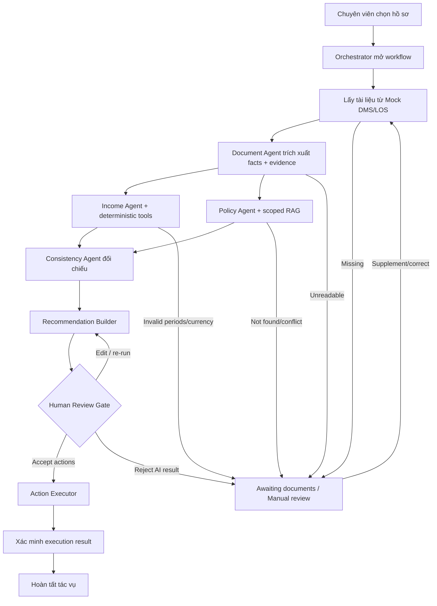
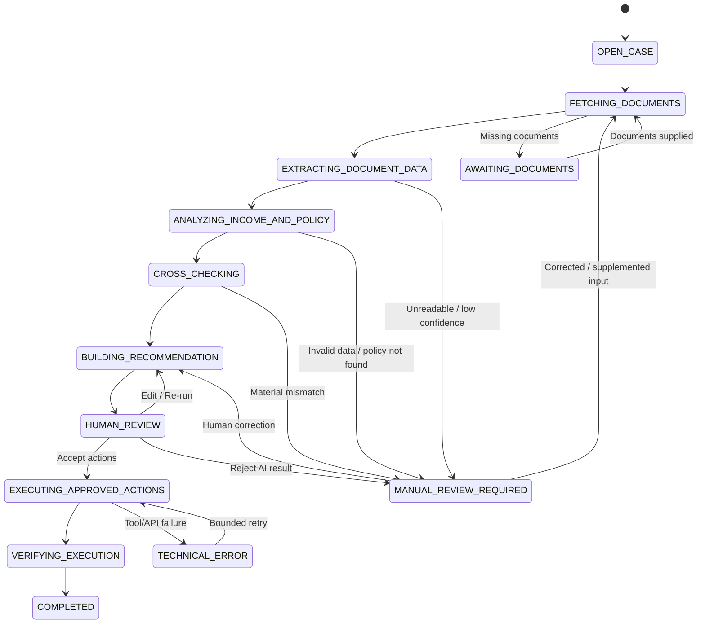

# Workflow — Income Verification Expert

Tài liệu này là nguồn vận hành cho MVP xác minh thu nhập. Actor duy nhất là **chuyên viên thẩm định tín chấp**; task duy nhất là **kiểm tra và xác minh thu nhập từ bộ hồ sơ vay**.

Agents phân tích và đề xuất. Chuyên viên xử lý phán đoán nghiệp vụ và xác nhận action chính thức. Action Executor là service duy nhất được gọi mutation API qua mock adapters.

---

## 1. Luồng tổng thể

Income Agent và Policy Agent chạy song song khi Document Agent đã cung cấp đủ input. Không dùng flow tuần tự Income → Policy.

## 2. Trách nhiệm

| Thành phần | Trách nhiệm | Không được làm |
| --- | --- | --- |
| Orchestrator | State, dispatch, checkpoint, retry, routing, schema validation | Tính thu nhập, diễn giải policy, mutation API |
| Document Agent | Trích xuất structured facts và evidence | Kết luận thu nhập đủ điều kiện |
| Income Agent | Phân loại giao dịch và gọi calculation tools | Tự làm số học bằng LLM |
| Policy Agent | Query policy đúng scope/effective date và tạo citation | Tự tạo rule/ngưỡng |
| Consistency Agent | Đối chiếu facts, calculations và policy results | Quyết định tín dụng |
| Recommendation Builder | Tạo kết quả, findings, evidence và action đề xuất | Phê duyệt/từ chối khoản vay |
| Human Review Gate | Accept/edit/reject AI result và duyệt action nhạy cảm | Không áp dụng |
| Action Executor | Permission, precondition, idempotency, execute, verify, audit | LLM reasoning hoặc gọi production API |

## 3. State machine chuẩn

Không có workflow state `APPROVED` hoặc `REJECTED` cho khoản vay. `EXECUTING_APPROVED_ACTIONS` chỉ có nghĩa là action của bước xác minh đã được chuyên viên chấp thuận.

## 4. Chi tiết từng bước

### 4.1. Open case

1. API kiểm tra identity, role và quyền với `application_id`.
2. Orchestrator tạo/resume workflow theo idempotency key.
3. Case Context được khởi tạo với `task_type=INCOME_VERIFICATION` và workflow version.
4. Audit event `WORKFLOW_OPENED` được ghi.

### 4.2. Fetch documents

1. DMS adapter lấy danh sách/file theo `case_id`.
2. Hệ thống kiểm tra loại file, checksum, kích thước, quyền và parse status.
3. Thiếu tài liệu bắt buộc → `AWAITING_DOCUMENTS` cùng danh sách cụ thể.
4. Không tự lấy dữ liệu từ CIC, thuế, bảo hiểm hoặc web.

### 4.3. Extract document data

1. Document Agent phân loại tài liệu.
2. Mỗi fact gắn document/page/row hoặc bounding box và `evidence_id`.
3. Unreadable hoặc confidence dưới rule được duyệt → `MANUAL_REVIEW_REQUIRED`.
4. Agent không suy đoán fact bị thiếu.

### 4.4. Analyze income and policy

Hai branch chạy song song:

- Income branch validate facts rồi gọi deterministic tools để tính average, variation và deviation;
- Policy branch query RAG với domain/product/chunk type/effective date bắt buộc.

Period/currency mismatch, policy not found hoặc policy conflict tạo status rõ ràng và chuyển người; không dùng retry LLM để tạo dữ liệu thay thế.

### 4.5. Cross-check

Consistency Agent kiểm tra:

- declared income với salary transactions;
- employer với transaction source;
- contract salary với amount thực nhận;
- period/currency/danh tính giữa các nguồn;
- required documents và policy requirements;
- calculation trace và citation completeness.

Mỗi finding có code, severity, values, rule version và evidence IDs.

### 4.6. Build recommendation

Recommendation Builder tạo:

- verification result draft;
- declared/average/eligible income;
- findings và missing documents;
- evidence và policy citations;
- proposed actions và permission class;
- unresolved issues.

Builder không tạo loan decision.

### 4.7. Human review

Chuyên viên chọn một outcome:

- `ACCEPT_ACTIONS`: chấp thuận kết quả/action của bước xác minh;
- `EDIT_AND_RERUN`: sửa fact/action có lý do và chạy lại bước bị ảnh hưởng;
- `MANUAL_HANDLING`: không chấp nhận kết quả AI và tiếp tục xử lý thủ công.

Review record phải có reviewer identity, timestamp, outcome, edits và reason. Không tự dùng record làm training data.

### 4.8. Execute and verify

Action Executor:

1. validate typed action;
2. kiểm tra quyền và human approval nếu action yêu cầu;
3. kiểm tra state precondition;
4. kiểm tra idempotency;
5. gọi đúng mock adapter;
6. read-back/verify kết quả;
7. ghi audit;
8. trả structured execution result.

Chỉ mark `COMPLETED` khi các action bắt buộc đã có kết quả xác định và audit đầy đủ.

## 5. Routing rules

Routing do deterministic rule engine quyết định, không do LLM tự chọn. Chuyển manual review khi:

- tài liệu unreadable hoặc extraction quality dưới ngưỡng;
- thiếu tài liệu/kỳ dữ liệu bắt buộc;
- identity, employer, period hoặc currency không khớp;
- chênh lệch vượt ngưỡng nghiệp vụ có version;
- policy not found, expired hoặc conflict;
- calculation/schema/tool failure sau bounded retry;
- action yêu cầu phán đoán hoặc official/outbound write.

Ngưỡng minh họa không được hard-code trong prompt. Runtime phải ghi rule version đã áp dụng.

## 6. Action permissions

### Auto-reversible

- đọc tài liệu theo quyền;
- tạo draft phiếu xác minh;
- đính kèm evidence vào draft;
- tạo task/nhãn nội bộ có thể đảo ngược;
- chuyển vào review queue nội bộ.

### Human-required

- gửi yêu cầu bổ sung ra ngoài;
- ghi nhận thu nhập chính thức;
- ghi chú chính thức vào LOS;
- đóng bước xác minh;
- chuyển sang công đoạn tiếp theo.

### Prohibited

- phê duyệt/từ chối khoản vay;
- thay đổi hạn mức hoặc bỏ qua policy;
- sửa/xóa tài liệu nguồn;
- production mutation trong MVP.

## 7. Retry và idempotency

- chỉ retry transient technical errors;
- mỗi node có timeout, `max_attempts` và backoff;
- missing evidence/policy là business exception, không retry;
- checkpoint sau state transition quan trọng;
- external action có idempotency key;
- ambiguous response phải verify trước khi retry;
- max retry dẫn tới `TECHNICAL_ERROR`/manual review, không phải success.

## 8. Audit requirements

Audit bắt buộc cho:

- workflow open/resume;
- document fetch/parse;
- agent/tool execution;
- calculation và rule version;
- policy query/citations;
- Case Context update;
- human review;
- action request/result/verification;
- mọi state transition.

Audit/log chỉ lưu reference và dữ liệu cần thiết, mask PII và không chứa secret hoặc raw document mặc định.

## 9. Definition of done cho workflow change

- state transition và schema bị ảnh hưởng được cập nhật ở cả code và docs;
- missing data, policy not found, mismatch và technical failure có đường đi rõ ràng;
- calculations và routing có deterministic tests;
- policy conclusions có scoped citations;
- official/outbound actions giữ human gate;
- idempotency và audit được test;
- không phụ thuộc vào legacy department pipeline trong target flow.
