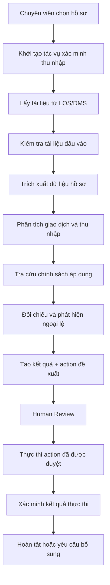

# Income Verification Expert - Workflow

This document defines the operational workflow for the Income Verification Expert MVP. It revolves quanh một actor duy nhất: **chuyên viên thẩm định tín chấp**, và một task duy nhất: **Xác minh thu nhập khách hàng từ hồ sơ vay và cập nhật kết quả vào LOS**.

Workflow được thiết kế theo kiểu state machine, trong đó agent thực hiện phân tích, con người xác nhận, và Action Executor mới được phép ghi dữ liệu chính thức.

## 1. Workflow Tổng thể



## 2. Phân công trách nhiệm

| Thành phần | Trách nhiệm |
| --- | --- |
| **Orchestrator** | Điều phối workflow, quản lý trạng thái và routing. |
| **Document Agent** | Đọc tài liệu và cung cấp dữ liệu có bằng chứng. |
| **Income Agent** | Phân tích giao dịch và tính chỉ số. |
| **Policy Agent** | Truy xuất chính sách đúng phiên bản. |
| **Consistency Agent** | Đối chiếu và tạo findings. |
| **Recommendation Builder** | Tạo báo cáo và action đề xuất. |
| **Human** | Phán đoán nghiệp vụ và phê duyệt action nhạy cảm. |
| **Action Executor** | Thực thi API theo rule và quyền. |
| **Audit Service** | Ghi lại dữ liệu, quyết định và hành động. |

## 3. Workflow chốt cho MVP

Luồng chạy chi tiết của MVP diễn ra như sau:

1. **Kích hoạt:** Chuyên viên kích hoạt xác minh thu nhập.
2. **Khởi tạo:** Orchestrator lấy và kiểm tra hồ sơ.
3. **Trích xuất:** Document Agent trích xuất dữ liệu từ các tài liệu.
4. **Phân tích song song:** Income Agent (phân tích giao dịch) và Policy Agent (truy vấn chính sách) chạy song song.
5. **Đối chiếu:** Consistency Agent phát hiện các sai lệch hoặc ngoại lệ.
6. **Đề xuất:** Hệ thống (Recommendation Builder) tạo bản nháp kết quả và các action đề xuất.
7. **Phê duyệt (Human-in-the-loop):** Chuyên viên kiểm tra, chỉnh sửa và phê duyệt các kết quả và action.
8. **Thực thi:** Action Executor cập nhật LOS, tạo task cho chuyên viên hoặc tạo form gửi yêu cầu bổ sung hồ sơ.
9. **Hoàn tất:** Hệ thống đọc lại kết quả thực thi, ghi audit (Audit Service) và hoàn tất workflow.

## 4. Quản lý Trạng thái (State Machine)

Các trạng thái chính của một case xác minh thu nhập:

```text
INIT
  -> FETCHING_DOCUMENTS
  -> EXTRACTING_DATA
  -> ANALYZING_INCOME_AND_POLICY
  -> CHECKING_CONSISTENCY
  -> PENDING_HUMAN_REVIEW
  -> APPROVED (chuyển sang EXECUTING_ACTIONS) / REVISION_REQUESTED
  -> EXECUTING_ACTIONS
  -> COMPLETED
```
Mọi sự chuyển đổi trạng thái chính thức đều được `Audit Service` lưu lại nhằm phục vụ việc kiểm tra và đối chiếu sau này.
